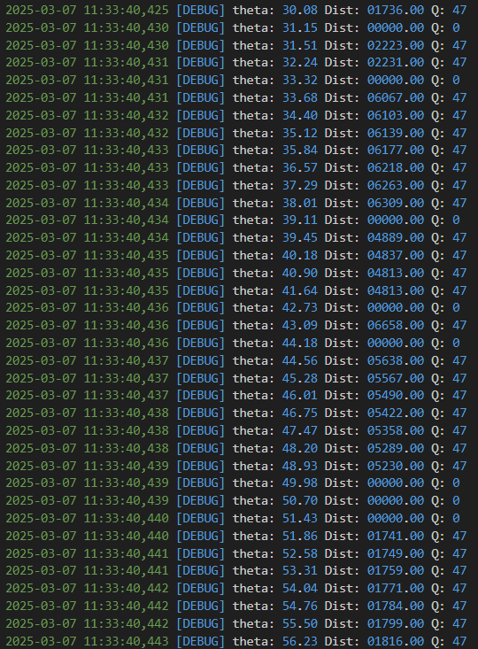
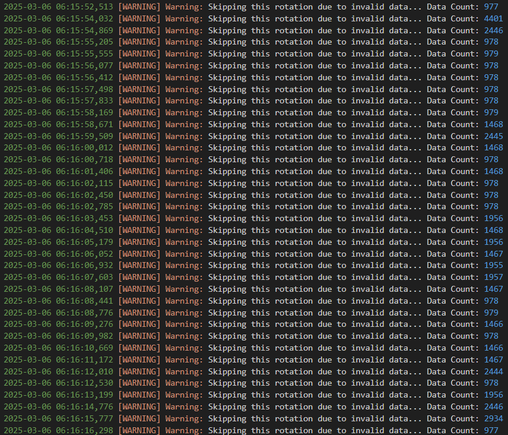
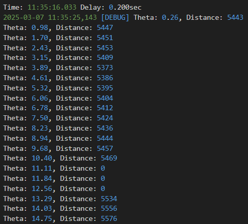
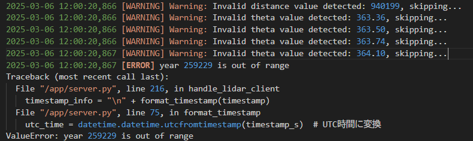
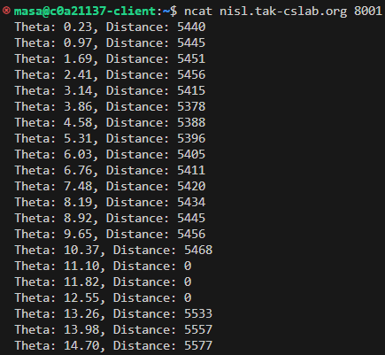
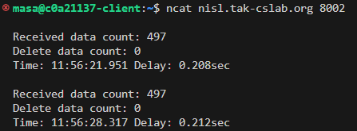

# LiDAR_compression
LiDARデータを圧縮するコードと解凍するサーバー側のコードが入ってます．

##  client.py
このファイルではRPLidar C1から出力されたデータを用います．
input_file_pathにLiDARデータのパスを入れてください．このデータをprocess_lidar_data()で値の読み取り，差分計算，バイナリデータ変換，送信が行われます．
LiDARデータを一周ごとに差分計算を行い送信します．送信時にハッシュ値も一緒に送信します．
デバッグ用で差分計算の結果や送信するbinファイルが出力されます．
実行結果はlogsフォルダ内のlogファイルに保存されます．
info_logs/info.logにLidarから取得した角度，距離，Qの値とその値を取得した時のタイムスタンプが保存されます．
error_logs/error.logにはエラーが発生した時の出力，フィルターによりどのような処理がされたのかを出力します．

## server.py
このファイルではclient.pyで送られるデータを解凍し差分データを取り出します．受信したバイナリファイルのハッシュ値を計算しハッシュ値の比較を行います．その後，差分データを足し合わせて値を元データに戻していきます．
logs/info_logs/info.logというファイルに解凍結果と通信遅延を出力します．また，logs/error_logs/error.logにファイルターによる処理の内容とエラーが発生した時の表示を出力します．さらに、受信したデータを8001番ポートに出力し，受信したデータ数，フィルターにより削除したデータ数，通信遅延の3つを8002番ポートに出力します．この出力結果はcurlやncatを使用してポートにアクセスすると表示できます．
コンテナでの使用を想定しています．

## Dockerfile
server.pyをコンテナで動作させるためのファイルです．server.pyに変更を加えた際は必ずbuildをして変更を反映させてください．Kubernetesで実行するときは，DockerアカウントのリポジトリにpushしてからPodとserviceを立ててください．

## lidar_server_pod.yaml
server.pyをKubernetes上で動作させるためのPodを起動するためのyamlファイルです．

## lidar_server_service.yaml
server.pyをKubernetes上で動作させるためのserviceを起動するためのyamlファイルです．

## test.txt
このファイルにはLiDARデータ1周分が記録されています．

# 実行結果
client.pyでは以下のような表示されます．

info.logの一部

error.logの一部

server.pyでは実行すると以下のような出力がされます．

info.logの一部

error.logの一部

client.pyとserver.pyを実行すると以下のような表示が8001，8002番ポートに出力されます．  

8001番ポート

8002番ポート

